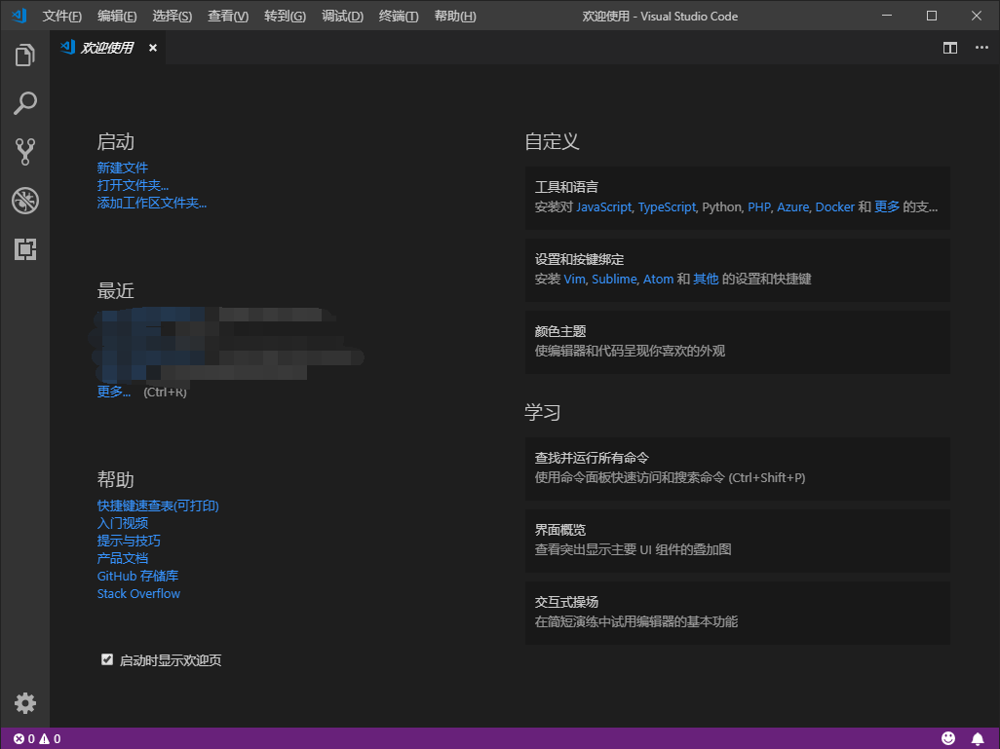

# VS code 安装配置基础

### 安装

下载最新的 [**VS code 官方网站**](https://code.visualstudio.com/Download)

根据系统进行选择下载安装

安装好后初始界面

### 基础

#### 资源管理器

**资源管理器** (`Ctrl+Shift+E`) 主要功能是管理目录、文档或代码文件等

vscode 中可以通过添加文件夹 (`Ctrl+k Ctrl+o`) 在资源管理器中展示出来

正在编辑的文件会在打开的编辑器中集中展示 很实用的两个快捷键

| 快捷键            | 功能                        |
| :---------------- | :-------------------------- |
| Ctrl + K S        | 全部保存编辑过的文件        |
| Ctrl + K Ctrl + W | 关闭全部打开的文件(指tab页) |

#### 搜索

**搜索** (`Ctrl+Shift+F`) 中可以快速查询文件内容

#### 源代码管理器

**源代码管理器** (`Ctrl+Shift+G`) 可以查看文件改动 可以配合 Git 使用

#### 调试

**调试** (`Ctrl+Shift+D`) 可以进行代码调试 以及调试环境配置

#### 扩展

**扩展** (`Ctrl+Shift+X`) 对插件进行搜索管理

#### 常用快捷键总结

输入命令 (`F1`)

#### 文件处理命令

| 快捷键            | 命令              | 说明           |
| :---------------- | :---------------- | :------------- |
| Ctrl + N          | New Untitled File | 创建无标题文件 |
| Ctrl + O          | Open File         | 打开文件       |
| Ctrl + K Ctrl + O | Open Folder       | 打开文件夹     |
| Ctrl + Shift + N  | New Window        | 新建窗口       |
| Ctrl + S          | Save              | 保存           |
| Ctrl + Shift + S  | Save As           | 另存为         |
| Ctrl + K S        | Save All          | 全部保存       |

#### 文本编辑命令

| 快捷键               | 命令       | 说明               |
| :------------------- | :--------- | :----------------- |
| Ctrl + Z             | Undo       | 撤销               |
| Ctrl + U             | cursorUndo | 软撤销             |
| Ctrl + Y             | redo       | 恢复               |
| Ctrl + A             |            | 全选               |
| Ctrl + C             |            | 选中文本--复制     |
| Ctrl + X             |            | 选中文本--剪切     |
| Ctrl + V             |            | 选中文本--粘贴     |
| Ctrl + /             |            | 选中文本--注释     |
| Ctrl + F             | Find       | 查找               |
| F3                   |            | 查找下一个         |
| Ctrl + F3            |            | 查找下一个选择     |
| Shift + F3           |            | 查找上一个         |
| Ctrl + Shift + F3    |            | 查找上一个选择     |
| Ctrl + H             | Replace    | 替换               |
| Ctrl + Shift + .     |            | 替换为下一个值     |
| Ctrl + Shift + ,     |            | 替换为上一个值     |
| Ctrl + G             |            | 移动光标到某行     |
| Ctrl + Alt + ↑/↓     |            | 复制光标，多行编辑 |
| Ctrl + Enter         |            | 向下添加一行       |
| Ctrl + Shift + Enter |            | 向上添加一行       |
| Shift + Alt + ↑      |            | 向上复制一行       |
| Shift + Alt + ↓      |            | 向下复制一行       |

#### 命令配置

| 快捷键                | 命令               | 说明         |
| :-------------------- | :----------------- | :----------- |
| Ctrl + Shift + P (F1) |                    | 打开命令面板 |
| Ctrl + Shift + E      | Show Explorer      | 资源管理器   |
| Ctrl + Shift + F      | Show Search        | 搜索         |
| Ctrl + Shift + G      | Show SCM           | 源代码管理   |
| Ctrl + Shift + D      | Show DEbug         | 调试         |
| Ctrl + Shift + X      | Show Extensions    | 扩展         |
| Ctrl + ,              | Open User Settings | 打开用户设置 |

### 配置

#### 插件

通过安装扩展插件可以更好的客制化编辑器

- **Chinese (Simplified) Language Pack for Visual Studio Code** 适用于 VS code 的中文（简体） 语言包
- **Markdown All in One** 方便编写markdown文档的插件
- **Path Intellisense** 当代码中出现文件名或路径时提供自动补全功能
- **topper** 在 .py 文件开头插入heardr信息
- **Bracket Pair Colorizer** 在代码中给括号增加颜色 尤其是在多层括号中看起来更加清晰
- **vscode-icons** VScode 官方提供的插件，给 VScode 编辑的文件增加图标
- **vscode-icons-mac** 和 VScode 官方提供的比起来 MAC 风格的图标 更加美观
