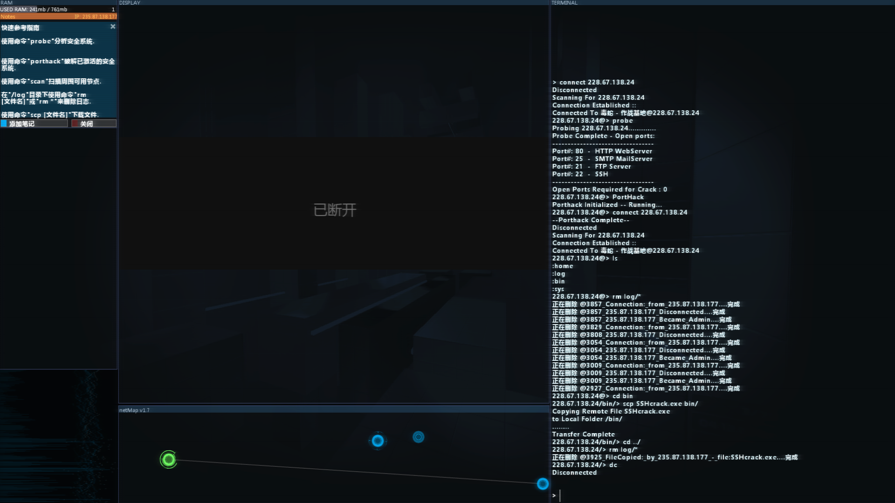

# Hack net notes

### First email: Initial contacl（初次联系）

task : delete file SecurityTracer.exe.（删除文件securitytracer.exe）

```powershell
connect 235.87.138.177[IP]
cd bin/
rm SecurityTracer.exe
cd ../
rm log/*
```

Task Completion Reply E-mail（任务完成回复电子邮件）

### Let's get some tools together.（让我们来一起获取一些工具）

task: Log on to the Viper server to get programs in bin directory（登录Viper服务器获取bin目录下程序）

```powershell
connect 228.67.138.24
probe
PortHack
ls
rm log/*
cd bin/
scp SSHcrack.exe bin/
cd ../
rm log/*
dc
```




