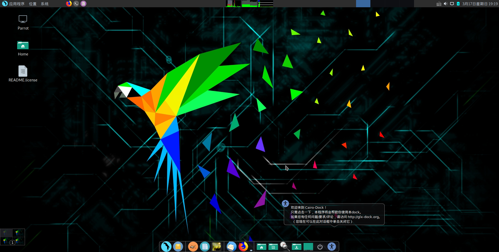
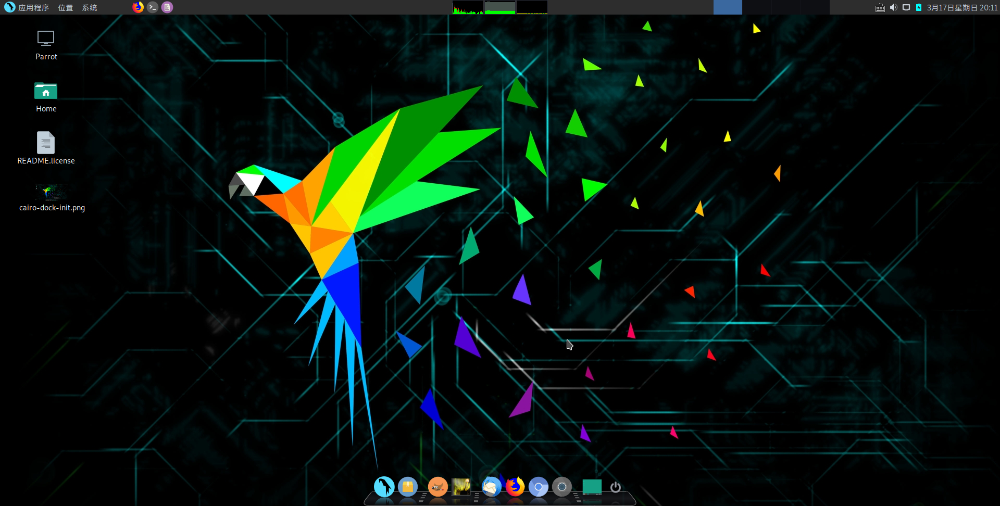

# parrot security os

### 安装配置

#### 更新系统

```
sudo apt-get update
sudo apt-get dist-upgrade
```


#### 添加更新语言

`sudo dpkg-reconfigure locales`
空格选择

```
[*] en_US.UTF-8
[*] zh_CN.UTF-8
```

用TAB 切换确定
上下移动到哪种语言后 在tab切换到确定按钮回车

#### 安装emacs 编辑器

`sudo apt-get install emacs25`


#### 安装谷歌拼音

`sudo apt-get install fcitx-googlepinyin`


#### 软件包安装

`sudo dpkg -i <***.deb>`


#### 安装chromium浏览器

`sudo apt-get install chromium`


#### 配置ssh

编辑sshd\_config文件:

`sudo pluma /etc/ssh/sshd_config`

修改 `"PermitRootLogin prohibit-password"` 为 `"PermitRootLogin yes"`

保存文件，启动ssh服务

`sudo service ssh start`

设置开机启动

`sudo updata-rc.d ssh enable`


### Parrot security 美化

#### 配置一个dock

安装 Cairo-Dock

```powershell
sudo apt-get update
sudo apt-get install cairo-dock cairo-dock-plug-ins

```



#### 修改dock配置后样式



